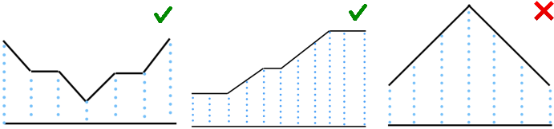

# A. 중앙값(Medium Number)

시간 제한 1s, 메모리 제한 256MB

세 개의 서로 다른 정수 $a,b,c$가 주어진다. 세 개의 정수 중에서 최솟값도 최댓값도 아닌 중앙값을 찾아라. 예를 들어 $5,2,6$중의 중간 수는 최대값이 6이고 최솟값이 2이므로 중간수는 $5$이다. 
____

**입력**

첫번째 줄에는 총 테스트 케이스 수 $t$가 주어진다. $(1\leq t\leq 6840)$.
각 테스트 케이스 마다 세 개의 서로 다른 정수 $a,b,c$가 주어진다.
_____
**출력**

각 케이스마다 주어진 수 $a,b,c$의 중앙값을 구하라. 
_____
**테스트 케이스**
```
#input
9
5 2 6
14 3 4
20 2 1
1 2 3
11 19 12
10 8 20
6 20 3
4 1 3
19 8 4
#output
5
4
2
2
12
10
6
3
8
```
# B. Atilla가 좋아하는 문제 (Atilla's favorite problem)

시간제한 1s, 메모리 제한 256MB

문자열을 작성하기 위해 Atilla는 문자열에 속한 모든 문자들을 익혀야 한다. 

Atilla는 문자열 $s$로 메시지를 작성해야 한다. 그는 메시지를 작성하기 위해 필요한 최소 '알파벳 크기'를 물어본다. 

'알파벳 크기' $x(1\leq x\leq 26)$는 첫 $x$개의 알파벳 글자로 이루어져 있다. 예를 들어 '알파벳 크기' 4는 $a,b,c,d$ 4개의 글자만을 포함한다.
____

**입력**

첫번째 줄에는 총 테스트 케이스 수 $t$가 주어진다. $(1\leq t\leq 1000)$.
각 테스트 케이스의 첫번째 줄에는 문자열의 크기 $n(1\leq n\leq 100)$이 주어진다. 

각 테스트 케이스의 두번째 줄에는 알파벳 소문자로만 구성된 길이 $n$의 문자열 $s$가 주어진다.
_____
**출력**

각 케이스마다 Atilla가 문자열 $s$를 작성하는 데 필요한 최소 '알파벳 크기'를 출력하라.
_______
**테스트 케이스**
```
#input
5
1
a
4
down
10
codeforces
3
bcf
5
zzzzz
#output
1
23
19
6
26
```
# C. 이점(Advantage)

시간제한 2s, 메모리 제한 256MB

$i$번째 참가자의 능력이 $s_{i}$인 $n$명의 참가자가 있는 대회가 있다. 

모든 참가자들은 그들이 자신을 제외한 참가자 중 가장 능력이 좋은 참가자에 비해 얼마나 이점을 갖고 있는지를 알고 싶어한다. 다시 말해, $i$번째 참가자는 자신 제외 능력이 가장 좋은 참가자가 $j$번째라고 할 때 $s_{i}$와 $s_{j}$의 차이를 알고싶어한다. (이 차이는 음수가 될 수 있다.)

참가자들은 당신에게 그 차이를 알려주기를 바라고 있다. 각 $i(1\leq i\leq n)$에 대해 $s_{i}$와 $i$번째 사람을 제외한 사람들 중 가장 능력이 좋은 사람과의 능력 차이를 출력하라. 

____

**입력**

첫번째 줄에는 총 테스트 케이스 수 $t$가 주어진다. $(1\leq t\leq 1000)$.
각 테스트 케이스에는 참가자들의 능력을 나열한 배열의 크기 $n(2\leq n\leq 2\times10^{5})$이 주어진다. 

각 테스트 케이스의 두번째 줄에는 참가자의 순서에 맞춰 각 참가자의 능력 $s_{1},s_{2},...,s_{n}(1\leq s_{i}\leq 10^{9})$이 주어진다.

모든 테스트 케이스에 대한 배열의 크기 $n$의 합이 $2\times 10^{5}$를 넘지 않음은 보장되어 있다.
_____
**출력**

각 테스트 케이스마다 각 참가자와 본인 제외 최고 능력을 지닌 참가자와의 능력 차이를 의미하는 정수 $n$개를 출력하라.
____
**테스트 케이스**
```
#input
5
4
4 7 3 5
2
1 2
5
1 2 3 4 5
3
4 9 4
4
4 4 4 4
#output
-3 2 -4 -2 
-1 1 
-4 -3 -2 -1 1 
-5 5 -5 
0 0 0 0 
```
# D. 빡센 계곡들(Challenging Valleys)

시간제한 2s, 메모리 제한 256MB

당신에게는 $n$개의 정수로 이루어진 배열 $a$가 주어진다. 만일 이 배열에서 다음과 같은 조건을 만족하는 부분 배열 $a[l,l+1,...r]$이 유일하게 존재하면 우리는 이 배열을 "계곡"이라 부른다. 

* $0\leq l\leq r\leq n-1$
* $a_{l}=a_{l+1}=...=a_{r}$
* $l=0$이거나 $a_{l-1}>a_{l}$
* $r=n-1$이거나 $a_{r}<a_{r+1}$

여기에 세가지 예시가 있다. 

첫 번째 예시는 $[3,2,2,1,2,2,3]$ 배열을 보여주고, 이는 $l=r=3$으로 조건을 만족하는 부분배열이 유일하게 존재한다. 

두 번째 예시는 $[1,1,1,2,3,3,4,5,6,6,6]$ 배열을 보여주고, 이는 $l=0,r=2$으로 조건을 만족하는 부분배열이 유일하게 존재한다. 

세 번째 예시는 $[1,2,3,4,3,2,1]$ 배열을 보여주며 조건을 만족하는 부분배열이 $l=r=0$과 $l=r=6$이 존재한다. 

주어진 배열이 계곡인지 아닌지를 판별하라.

당신은 이 배열의 첫 항이 0번째로 번호가 매겨짐을 유의해야 한다.

____

**입력**

첫번째 줄에는 총 테스트 케이스 수 $t$가 주어진다. $(1\leq t\leq 10^{4})$.
각 테스트 케이스에는 배열의 크기 $n(1\leq n\leq 2\times10^{5})$이 주어진다. 

각 테스트 케이스의 두번째 줄에는 배열의 각 원소인 정수 $a_{i}(1\leq a_{i}\leq 10^{9})$가 총 $n$개 주어진다.

모든 테스트 케이스에 대한 배열의 크기 $n$의 합이 $2\times 10^{5}$를 넘지 않음은 보장되어 있다.
_____
**출력**

각 테스트 케이스마다 그 배열이 계곡이면 `YES`를 아니면 `NO`를 출력하라. 

당신은 각 답변마다 대소문자를 구별할 필요가 없다. (예를 들어, `Yes,yEs,yes`는 모두 긍정의 답으로 인식될 것이다.)
____
**테스트 케이스**
```
#input
6
7
3 2 2 1 2 2 3
11
1 1 1 2 3 3 4 5 6 6 6
7
1 2 3 4 3 2 1
7
9 7 4 6 9 9 10
1
1000000000
8
9 4 4 5 9 4 9 10
#output
YES
YES
NO
YES
YES
NO
```

# E. 이진 역순(Binary inversions)

시간제한 2s, 메모리 제한 256MB

당신에게는 길이 $n$의 이진 배열이 주어져 있다. 당신은 이 배열에 최대 한번의 조작을 가할 수 있다. 이 조작은 배열의 임의의 원소를 그 원소가 0이면 1로, 1이면 0으로 바꾸는 것이다. 

최대 한번의 조작을 수행하고 난 후 배열에 존재하는 최대 역순의 개수는 몇 개인가?

* 이진 배열이란 모든 원소가 0또는 1로 이루어진 배열을 의미한다. 
* 역순의 개수란 $i<j$에 대해 $a_{i}>a_{j}$를 만족하는 $(i,j)$ 순서쌍의 개수를 의미한다.

____

**입력**

첫번째 줄에는 총 테스트 케이스 수 $t$가 주어진다. $(1\leq t\leq 10^{4})$.
각 테스트 케이스에는 배열의 크기 $n(1\leq n\leq 2\times10^{5})$이 주어진다. 

각 테스트 케이스의 두번째 줄에는 배열의 각 원소인 정수 $a_{i}(0\leq a_{i}\leq 1)$가 총 $n$개 주어진다.

모든 테스트 케이스에 대한 배열의 크기 $n$의 합이 $2\times 10^{5}$를 넘지 않음은 보장되어 있다.
_____
**출력**

각 테스트 케이스마다 최대 한번의 조작을 통해 나올 수 있는 최대 역순의 개수를 출력하라.
____
**테스트 케이스**
```
#input
5
4
1 0 1 0
6
0 1 0 0 1 0
2
0 0
8
1 0 1 1 0 0 0 1
3
1 1 1
#output
3
7
1
13
2
```

# F. 퀘스트(Quests)

$n$개의 퀘스트가 있다. 만일 당신이 $i$번째 퀘스트를 해결하면 $a_{i}$ 만큼의 동전을 얻게 된다. 하지만, 당신이 어떤 퀘스트를 수행하면 $k$일 동안에는 같은 퀘스트에 도전할 수 없다. 예를 들어 $k=2$이고 1일차에 퀘스트 1을 수행했다면 2,3일차에는 퀘스트 1을 할 수 없고 4일차부터 다시 수행할 수 있다.

당신에게는 $c,d$ 두 개의 정수가 주어진다. $d$일동안 $c$개 이상의 동전을 모을 수 있는 최대 정수 $k$의 값을 구하여라. 만일 그러한 $k$가 존재하지 않으면 `Impossible`을 출력하고, 무한히 커질 수 있다면 `Infinity`를 출력하라. 

____

**입력**

첫번째 줄에는 총 테스트 케이스 수 $t$가 주어진다. $(1\leq t\leq 10^{4})$.
각 테스트 케이스의 첫번째 줄에는 각각 퀘스트의 개수, 필요한 동전의 수, 주어진 기간에 해당하는 정수 $n,c,d(2\leq n\leq 2\times 10^{5},1\leq c\leq 10^{16}, 1\leq d\leq 2\times 10^{5})$가 주어진다.

각 테스트 케이스의 두번째 줄에는 각 퀘스트를 수행했을 때의 보상 $a_{1},a_{2},...,a_{n}(1\leq a_{i}\leq 10^{9})$가 주어진다.

모든 테스트 케이스에 대한 배열의 크기 $n$의 합이 $2\times 10^{5}$를 넘지 않음이 보장되어 있으며 $d$의 합 또한 $2\times 10^{5}$를 넘지 않음이 보장되어 있다.
_____
**출력**

각 테스트 케이스마다 $k$가 존재하지 않으면 `Impossible`, $k$가 무한히 커도 가능하면 `Infinity`, 아니면 가능한 최대 정수 $k$를 구하여라. 
____
**테스트 케이스**
```
#input
6
2 5 4
1 2
2 20 10
100 10
3 100 3
7 2 6
4 20 3
4 5 6 7
4 100000000000 2022
8217734 927368 26389746 627896974
2 20 4
5 1
#output
2
Infinity
Impossible
1
12
0
```

# G. SlavicG가 좋아하는 문제(SlavicG's favorite problem)

당신에게는 $n$개의 정점으로 이루어진 가중치 트리가 주어져 있다. (weighted tree) 가중치 트리란 노드와 노드 사이 엣지에 가중치가 주어진 트리를 의미한다. 트리는 방향이 정해지지 않은 그래프이며 루트(root)가 따로 정해져 있지 않다. 

트리가 당신을 지루하게 만들기 때문에, 당신은 주어진 트리에서 게임을 하여 자기자신에 도전을 하기로 하였다. 

각 이동마다 당신은 노드에서 이웃한 노드로 이동할 수 있다. 당신은 처음에 $0$으로 초기화 된 변수 $x$와 함께 시작하며 $i$ 엣지를 지날때 변수 $x$는 $x$와 $i$엣지의 가중치 $w_{i}$와 XOR연산된 것으로 변하게 된다.

당신의 임무는 노드 $a$에서 노드 $b$로 이동하는 것이며 당신은 노드 $b$에 도착하기 위해 반드시 $b$에 도착할 때 변수 $x$의 값이 0이 되어야 한다. 다시 말해, 당신이 마지막에 노드 $b$에 도착하기 위해서는 $x$의 값과 $b$로 이동할 때 사용하는 엣지의 가중치 $w_{i}$와의 XOR 연산값이 0이 되어야 한다는 것이다. 당신이 노드 $b$에 도착하면 게임은 끝이 나고 당신이 이기게 된다. 

추가로, 당신은 중간에 $b$를 제외한 다른 노드에 최대 한번만 순간이동을 할 수 있다. 당신은 어느 노드는 이동할 수 있으며 $a$로도 다시 돌아갈 수 있다. 

만일 $a$에서 $b$로 이동할 수 있으면 `YES`를, 불가능하면 `NO`를 출력하라. 

XOR 연산은 [Bitwise XOR](https://en.wikipedia.org/wiki/Bitwise_operation#XOR) 연산을 의미한다.

____

**입력**

첫번째 줄에는 총 테스트 케이스 수 $t$가 주어진다. $(1\leq t\leq 1000)$.
각 테스트 케이스의 첫번째 줄에는 각각 노드의 개수, 시작노드의 인덱스, 목적지 노드의 인덱스를 의미하는 정수 $n,a,b(2\leq n\leq 2\times 10^{5},1\leq a,b\leq n, a\neq b)$가 주어진다.

각 테스트 케이스마다 $n-1$개의 줄에 엣지의 정보가 담겨 있다. 각 줄에는 엣지의 양끝 노드의 정보 $u_{i},v_{i}(1\leq u_{i},v_{i}\leq n,u_{i}\neq v_{i},1\leq w_{i}\leq 10^{9})$가 순서대로 주어진다.

모든 테스트 케이스에 대한 배열의 크기 $n$의 합이 $10^{5}$를 넘지 않음이 보장되어 있다.
_____
**출력**

각 테스트 케이스마다 $a$에서 $b$로 이동하는 것이 가능하면 `YES`, 아니면 `NO`를 출력하라. 
____
**테스트 케이스**
```
#input
3
5 1 4
1 3 1
2 3 2
4 3 3
3 5 1
2 1 2
1 2 2
6 2 3
1 2 1
2 3 1
3 4 1
4 5 3
5 6 5
#output
YES
NO
YES
```