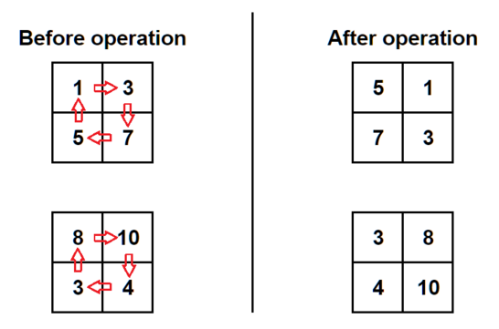

# A. A+B?
당신은 $a+b$형태로 입력이 주어져 있다. $a$와 $b$는 0과 9 사이의 정수이다. 당신은 이 연산을 수행하고 출력해야 한다. 

**<u> 입력 </u>**

첫번째 줄에는 입력하고자 하는 테스트 케이스의 개수 $t$가 주어져 있다. $(1\leq t\leq 100)$

각 테스트 케이스는 $a+b$의 형태로 한 줄로 나타나 있다. ($0\leq a,b\leq 9$)

**<u> 출력 </u>**

각 테스트 케이스마다 계산한 값을 출력한다. 

<br/>
<br/>

**<u> 예시 케이스 </u>**

* 입력
```
4
4+2
0+0
3+7
8+9
```
* 출력
```
6
0
10
17
```

## 풀이
 이 문제는 빠르게 풀어야 하는 문제이다. 굉장히 간단한 문제. 

 ```python
import sys
input=sys.stdin.readline
def solve():
    m,n=map(int, input().strip().split('+'))
    return str(m+n)+'\n'
txt=''
for _ in range(int(input())):
    txt+=solve()
print(txt)
 ```

# B. 행렬의 회전(Matrix Rotation)

당신에게는 서로 다른 정수들로 채워져 있는 $2\times2$행렬이 주어져 있다. 당신은 행렬을 '아름답게' 바꾸어야 한다. 행렬이 '아름답다'는 것은 다음 두 조건을 만족할 때이다.
* 각 행마다 첫번째 원소가 두번째 원소보다 클 때
* 각 열마다 첫번째 원소가 두번째 원소보다 클 때


당신은 원하는 횟수만큼 행렬을 시계방향으로 $90\degree$만큼 회전시킬 수 있다. 행렬의 윗행의 왼쪽 원소는 윗행 오른쪽으로 이동하고 윗행 오른쪽의 원소는 아랫행 오른쪽의 원소로 이동하는 식으로 이어진다. 



주어진 행렬이 0번 이상의 회전을 통해 '아름다운' 행렬이 될 수 있는지 결정하라.
<br/>
<br/>

**<u> 입력 </u>**

첫번째 줄에는 입력하고자 하는 테스트 케이스의 개수 $t$가 주어져 있다. $(1\leq t\leq 100)$

각 테스트 케이스는 두 줄로 구성되어 있다. 각 줄에는 두개의 정수가 포함되어 있으며 이 정수들은 행렬의 행에 대응된다. 행렬의 4개 원소는 1부터 100 사이의 서로 다른 정수로 구성되어 있다. 

**<u> 출력 </u>**

각 테스트 케이스마다 행렬이 '아름다워'질 수 있으면 'YES'를 아니면 'NO'를 출력하라. 당신은 대문자든 소문자든 어떤 형태로도 출력할 수 있다. (YES,Yes,yes는 모두 긍정의 답으로 인식될 것이며, NO,No,nO는 모두 부정의 답으로 인식될 것이다. )

**<u> 예시 케이스 </u>**

* 입력
```
6
1 3
5 7
8 10
3 4
8 10
4 3
6 1
9 2
7 5
4 2
1 2
4 3
```
* 출력
```
YES
YES
NO
YES
YES
NO
```
## 풀이

간단한 Brute force 문제이다. 

```python
import sys
input=sys.stdin.readline
def yn(l):
    if l[0][0]>l[0][1] and l[1][0]>l[1][1] and l[0][1]>l[1][1] and l[0][0]>l[1][0]:
        return True
    return False
def rot(l):
    return [[l[1][0],l[0][0]],[l[1][1],l[0][1]]]
def solve():
    l=[list(map(int, input().split())) for _ in range(2)]
    a=False
    for _ in range(4):
        a=a|yn(l)
        l=rot(l)
    if a:
        return "YES\n"
    return "NO\n"
        
txt=''
for _ in range(int(input())):
    txt+=solve()
print(txt)
```

# C. 다른 차이들(Different differences)

$k$개의 원소로 이루어져 있는 배열 $a$의 원소가 순서대로 $a_{1}<a_{2}<...<a_{n}$를 만족하면 강증가(Strictly increasing)한다고 하자. 예를 들어 배열 $[1,3,5],[1,2,3,4],[3,5,6]$은 강증가 하고 배열 $[2,2],[3,7,5],[7,4,3],[1,2,2,3]$은 강증가 하지 않는다. 
<br/>
<br/>
강증가 하는 원소 $k$개의 배열 $a$에 대해 배열의 '특징'을 배열 $[a_{2}-a_{1},a_{3}-a_{2},....,a_{n}-a_{n-1}]$의 서로 다른 원소의 개수라고 정의하도록 하자. 예를 들어, 배열 $[1,3,4,7,8]$의 특징은 $[2,1,3,1]$의 서로 다른 원소의 개수가 3개이므로 3이다. 
<br/>
<br/>
당신에게는 두개의 정수 $k$와 $n$이 주어져 있다.($k\leq n$) $k$개의 1부터 $n$ 사이의 수로 원소로 이루어진 최대 크기의 특징을 가진 강증가하는 배열을 만들어라. 

**<u> 입력 </u>**

첫번째 줄에는 입력하고자 하는 테스트 케이스의 개수 $t$가 주어져 있다. $(1\leq t\leq 819)$

각 테스트 케이스는 두 개의 정수 $k,n$으로 이루어진 한 줄로 구성되어 있다. ($2\leq k\leq n\leq 40$)

**<u> 출력 </u>**

각 줄마다 최대 특징을 가진 $k$개 원소로 이루어진 배열을 출력하라. 만일 그런 배열이 여러개라면 그 중 어느 하나를 출력하여도 상관없다. 

**<u> 예시 케이스 </u>**

* 입력
```
7
5 9
4 12
3 3
3 4
4 4
4 6
8 11
```
* 출력
```
1 3 4 7 8
2 4 7 12
1 2 3
1 3 4
1 2 3 4
2 4 5 6
1 2 3 5 6 7 8 11
```
## 풀이

위의 배열을 만들 수 있는지 없는지 가늠하기 위해서는 배열의 가장 작은 원소를 1로 설정한 후 $1,2,3,..., i,1,1,1,1,...$만큼 차이가 나도록 설정하여 가능한 최대 크기의 $i$를 찾으면 된다. 그것이 $n$보다 크다면 가능한 최대 특징은 $i$보다 작은 것이 된다. 
<br/>
<br/>
만일 각 원소 사이 차이를 $1,2,3,..., i,1,1,1,1,...$로 설정하면 배열의 맨 마지막 원소는 $1+1+2+3+...+i+1+1+...$가 되어 합이 $k+\frac{i(i-1)}{2}$가 된다. (이 때, $i$ 뒤의 1의 개수가 $k-1-i$개) 우리는 $k+\frac{i(i-1)}{2}$가 $n$보다 작거나 같은 최대 $i$를 찾고 $[1,1+1,1+1+2,...,1+1+2+...+i,1+1+2+....+i+1,1+1+2+...+i+1+1...]$ 배열을 답으로 출력하면 된다. 

해답 코드
```python
import sys
input=sys.stdin.readline
 
def solve():
    k, n=map(int, input().split())
    s=(k-1)
    l=1
    while s+(l*(l-1)//2)<n and l<=k:
        l+=1
    n=1
    res=[1]
    for i in range(1,l):
        n+=i
        res.append(n)
        if len(res)==k:
            break
    while len(res)<k:
        res.append(res[-1]+1)
    print(*res,sep=' ')
for _ in range(int(input())):
    solve()
```